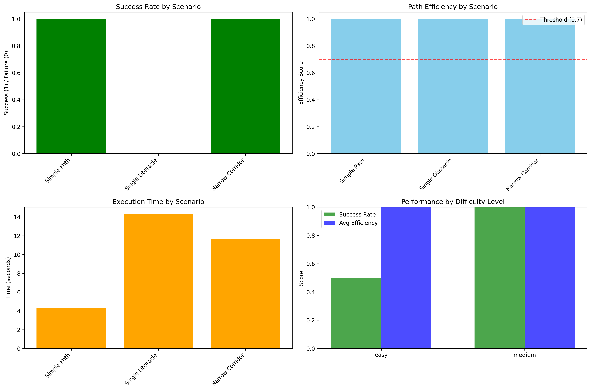

# cognitive-navigation
# LLM Navigation System with Spatial Reasoning

## Overview

This project implements an advanced LLM-based navigation system for robotic path planning with enhanced spatial reasoning and feedback mechanisms. The system combines real-time sensor data processing with large language model (LLM) decision-making to navigate complex environments efficiently.

## Key Features

- **Spatial Reasoning**: Maintains an internal grid-based map with obstacle tracking
- **Progress Monitoring**: Tracks distance to goal and detects regressions
- **Adaptive Movement**: Adjusts movement constraints based on environment certainty
- **Error Recovery**: Implements protocols for handling navigation failures
- **Benchmarking**: Comprehensive testing framework with scenario evaluation

## System Components

### Core Modules

1. **LLMNavigationSystem**: Main navigation controller
   - Processes sensor data
   - Maintains internal map state
   - Interfaces with LLM for path planning
   - Executes navigation actions

2. **NavigationBenchmark**: Testing framework
   - Multiple scenario types (open space, mazes, corridors)
   - Performance metrics (success rate, path efficiency)
   - Detailed reporting and visualization

### Data Models

- `SensorReading`: Distance measurements (front, left, right)
- `Action`: Movement commands (turn, move)
- `GridCell`: Individual map cell state
- `RobotState`: Current position, orientation, and trajectory
- `InternalMap`: Spatial representation of environment

## Installation

1. Clone the repository:
   ```bash
   git clone https://github.com/your-repo/llm-navigation.git
   cd llm-navigation
   ```

2. Install dependencies:
   ```bash
   pip install -r requirements.txt
   ```

3. Set environment variable:
   ```bash
   export GROQ_API_KEY="your-api-key-here"
   ```

## Usage

### Running the Navigation System

```python
from langgraph_new import LLMNavigationSystem, SensorReading

# Initialize with target position
nav_system = LLMNavigationSystem(target_position=(5, 5))

# Navigation loop
while not nav_system.is_goal_reached():
    # Get sensor readings (simulated or real)
    sensors = SensorReading(front=120.0, left=80.0, right=150.0)
    
    # Get next action
    action = await nav_system.navigate_step(sensors)
    
    # Execute action
    nav_system.execute_action(action)
    
    # View current map
    print(nav_system.get_current_map())
```

### Running Benchmarks

```bash
python simplified_runner.py
```

This will:
1. Execute all benchmark scenarios
2. Generate performance reports
3. Create visualizations
4. Provide improvement recommendations

## Benchmark Scenarios

The system includes 10 diverse test scenarios:

1. **Simple Path**: Straight-line navigation
2. **Obstacle Maze**: Complex obstacle arrangement
3. **Narrow Corridor**: Tight passage navigation
4. **U-Turn**: Requires 180-degree turn
5. **Dead End**: Needs backtracking
6. **Multi-Path**: Multiple route options
7. **Dynamic Obstacles**: Changing environment
8. **Large Open Space**: Efficiency test
9. **Spiral Path**: Continuous turning
10. **Complex Maze**: Advanced challenge

## Output Metrics

Each benchmark evaluates:

- **Success Rate**: Did the robot reach the goal?
- **Path Efficiency**: Optimal vs actual path length
- **Collision Avoidance**: Obstacle detection reliability
- **Robustness**: Error and timeout handling
- **Execution Time**: Performance characteristics

## Results Visualization

Benchmark results include:

- Success rate by scenario
- Path efficiency comparisons
- Execution time analysis
- Performance by difficulty level



## Configuration

Key parameters in `langgraph_new.py`:

```python
LLMNavigationSystem(
    target_position: Tuple[int, int],  # Goal coordinates
    cell_size_cm: int = 30,           # Grid cell size in cm
    max_sensor_range_cm: int = 300    # Maximum sensor range
)
```

## Dependencies

- Python 3.8+
- Required packages:
  - pydantic
  - httpx
  - loguru
  - numpy
  - matplotlib
  - seaborn
  - pandas
  - deepeval

## License

MIT License

## Contributing

Contributions are welcome! Please open an issue or pull request for any improvements.

## Future Work

- Add more sensor types (LIDAR, cameras)
- Implement multi-agent coordination
- Add dynamic obstacle handling
- Improve error recovery protocols